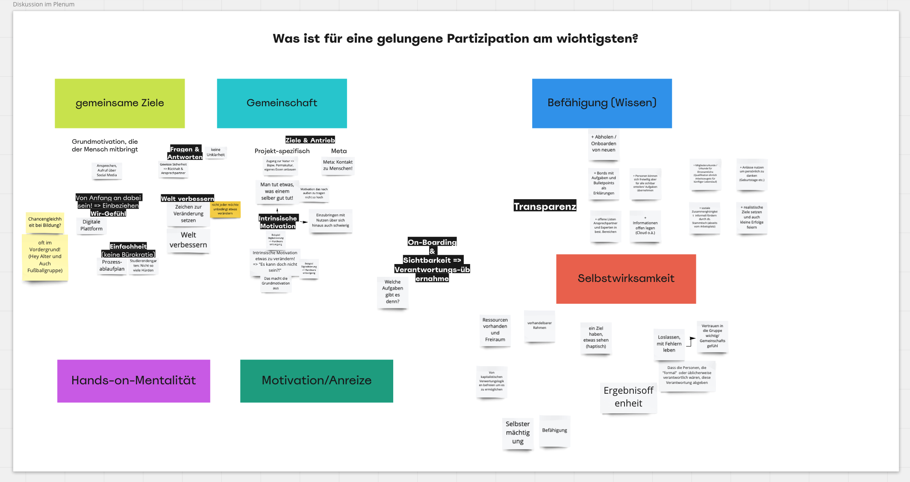

Am 24.11.2021 hielten wir, das Team PartComp, einen Online-Workshop im Rahmen der Participation Week des Leibniz-Wissenschaftscampus Braunschweig ab. Der Workshop trug den Titel:

*“**Gemeinsam gemeinsam:** Projekte, Vereine und interessierte Bürger:innen erkunden die Geheimnisse einer erfolgreichen Zusammenarbeit von Menschen zur Verbesserung ihres Lebens – zum Beispiel in der Stadt.”*

Das Ziel des Workshops war es also, Personen aus unterschiedlichsten Partizipationsumfeldern zusammenzubringen und mit ihnen über Erfolgsfaktoren der Partizipation und ihre Erfahrungen zu sprechen und zu diskutieren. Insgesamt nahmen 11 Personen teil. Es waren Personen von [Hey Alter](https://heyalter.com/ "https\://heyalter.com/"), [Fridays for Future](https://fff-braunschweig.de/ "https\://fff-braunschweig.de/"), [Nexus Braunschweig](https://www.dasnexus.de/ "https\://www.dasnexus.de/"), gemeinschaftlichen Gartenprojekten, [Sandkasten der TU Braunschweig](https://www.sandkasten.tu-braunschweig.de/ "https\://www.sandkasten.tu-braunschweig.de/"), [Grüne Finger aus Osnabrück](https://gruene-finger.de/projekt/ "https\://gruene-finger.de/projekt/"), [Amnesty International](https://www.amnesty.de/ "https\://www.amnesty.de/"), [Foodsharing](https://foodsharing.de/ "https\://foodsharing.de/") und dem [Georg-Eckert-Institut](http://www.gei.de/home.html "http\://www.gei.de/home.html") anwesend. Nach einer Einleitung und Vorstellung der einzelnen Teilnehmenden, führte Dr. Susanne Robra-Brissantz in Form eines kurzen Impulsvortrags in das Thema “6 Erfolgsfaktoren für Partizipation” ein. Diese umfassten:

* Gemeinsame Ziele,
* Gemeinschaft,
* Befähigung (Wissen),
* Selbstwirksamkeit,
* Hands-on-Mentalität und
* Motivation/Anreize. 


\
Im Anschluss war es den Teilnehmenden möglich, sich über ihre Erfahrungen in Kontext dieser Erfolgsfaktoren auszutauschen und ebenso neue Faktoren zu nennen. Für besonders relevant hielten viele gemeinsame Ziele, aber auch die Aspekte Gemeinschaft und Selbstwirksamkeit. Sie tauschten sich über Erfahrungen hinsichtlich der gemeinsamen Ziele aus und dass es in manchen Situation schwierig war diese zu bestimmen. Zum Beispiel, wenn es häufig wechselnde Mitglieder gibt. Daraufhin teilten sich die Teilnehmenden den Erfolgsfaktoren für die Kleingruppenarbeit zu. In der nächsten Phase war es das Ziel für die einzelnen Erfolgsfaktoren Handlungsanweisungen anhand der Erfahrungen der Teilnehmenden zusammenzutragen. Sie hatten die Möglichkeit so über Punkte zu sprechen, die ihnen vielleicht in ihrem Engagement Schwierigkeiten bereiten, oder anderen von ihren positiven Erfahrungen zu einem Punkt zu berichten, sodass diese davon lernen konnten. Es bildeten sich drei Gruppen mit zwei bis vier Teilnehmenden: 1: “Gemeinsame Ziele & Gemeinschaft”, 2: “Befähigung & Selbstwirksamkeit” und 3: “Selbstwirksamkeit”. Nach der Kleingruppenarbeit wurden die Ergebnisse zusammengetragen.

Gruppe 1 sah für den Faktor der gemeinsame Ziele und Antrieb auf der Meta-Ebene den Aspekt in Kontakt mit Menschen zu sein, oder projektspezifisch bei zum Beispiel Gartenprojekten, die Nähe zur Natur. Ebenso sprachen sie von intrinsischer Motivation, die durch Momente wie “Es kann doch nicht sein, dass…?!” hervorgerufen wird. Für viele sei dies die Grundmotivation. Es wurde von dem Ziel die Welt zu verbessern gesprochen. Dabei wurde aber auch angemerkt, dass nicht jede:r etwas verändern möchte. In Bezug auf den Aspekt der Gemeinschaft sprachen sie von Einfachheit und wenig Bürokratie, sowie Ansprechpartner:innen.\
Für Gruppe 2 waren Onboardings von (Neu-)Mitgliedern ein wichtiger Teil, um Partizipierende zu befähigen. Es geht auch um Transparenz in den Arbeitsweisen in Form von Boards, Aufgabenbeschreibungen und Aufgabenverteilung. Die Selbstwirksamkeit könnte laut Gruppe 2 zum Beispiel durch Mitgliederurkunden für den Lebenslauf, die Qualifikationen aufzeigen sollen gesteigert werden. Es kam auch die Idee von einem Stammtisch auf, um die Zusammengehörigkeit zu fördern.\
Gruppe 3 sprach in Bezug auf die Selbstwirksamkeit davon, dass diese Ressourcen, Freiraum und einen verhandelbaren Rahmen benötigt. Ebenso sollte das Handeln der Gruppe ein Ziel haben, das auch (haptisch) erfahrbar sein sollte. Es wurde von Verantwortungsabgabe und Loslassen gesprochen, wofür Ergebnisoffenheit ein wichtiger Punkt sei. Damit Personen selbstermächtigt handeln können, sei Vertrauen in die Gruppe und ein Gemeinschaftsgefühl wichtig.

Die Ergebnisse der Kleingruppensessions wurden auf einem Miroboard gesammelt. Nach der Vorstellung der Ergebnisse war Raum für Anmerkungen, Austausch und Diskussion, welcher auch produktiv genutzt wurde. Die wichtigsten Punkte aus dem Workshop wurden in einem Graphical Recording zusammengetragen.

Der Workshop enthielt vielen spannenden Input für unser Projekt aus dem wir für zukünftige Forschung Inspiration und Ansätze ziehen können.

